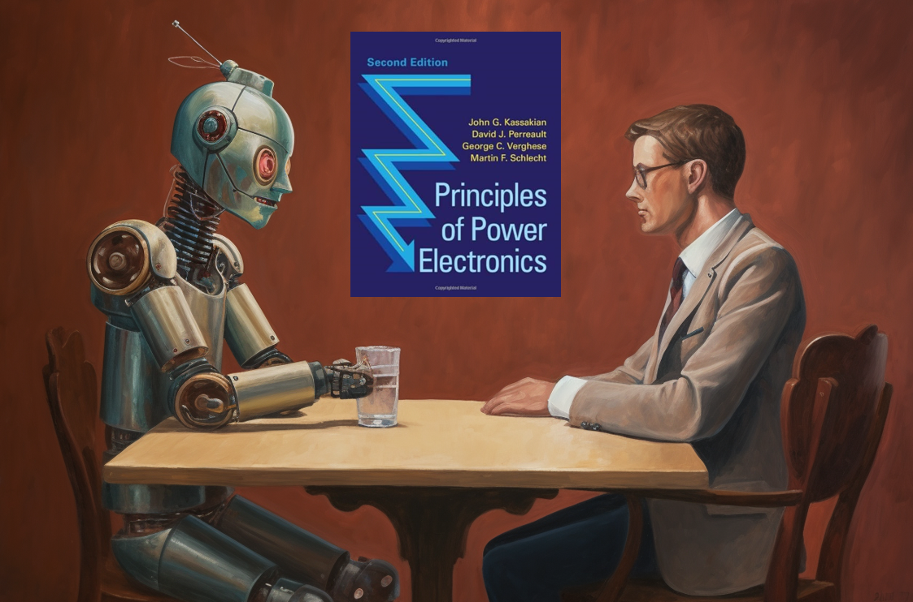

# Power Electronics Turing Test - A Path Toward Strong AI in Power Electronics

This site provides the latest information about Power Electronics Turing Test, a project initiated by the Power Electronics Lab at Princeton University to enable Strong AI in power electronics

